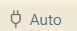

Explore arduino projects

"arduino" is many things, including a company, a language, and an ecosystem. 

You will use *pioarduino* to manage arduino projects. *Pioarduino* is a variant of the platformio programming environment. 

Our introductory projects are `blink` and `blink-without-delay`.  

## install programming environment

- install VSCode: https://code.visualstudio.com/

- install the `piorduino` extension (`ctrl`-`shift`-`x` to search extensions)

  - `pioarduino` may also ask you to install python

  

## blink example

Open the blink example in VSCode. To open a platformio project:

- file → open folder
- select the folder 'blink'
- 'select folder'

You can interact with the files in a platformio project by viewing the files in the folder. 

The code is contained in `main.cpp`. Review that file now. 

Arduino programs largely consist of 4 parts:

- NOTE: `//` denotes a comment
- (optional) global definitions
- setup() {…} // this code runs once every time the microcontroller starts
- (optional) more definitions
- loop() {…} // this code runs repeatedly forever

Now program your microcontroller. Connect it to your computer via USB. 

You may have to explicitly select the correct USB/Serial port. To do so click this icon on the bottom status bar.  The correct port is probably the highest number. 

Upload the code to your microcontroller. 

- Open the platformio menu panel. 
- rp2040_adalogger → general → upload

A red LED near the USB port should begin blinking. 

After you upload the code, the microcontroller will run that program every time it restarts. You can restart by unplugging/replugging the USB cable or by pressing the RESET button. 

You can adjust the `delay()` values to change the blink speed. 

`delay()` completely pauses the microcontroller; nothing else can happen during the delay. This is suitable for a simple blink example, but becomes a problem for anything more complicated. Consider how you would blink 2 LEDs. 

## blink without delay

To blink an LED without using `delay()`, use the classic arduino example `blink-without-delay`, sometimes called BWD. 

Open the `blink-without-delay` folder. 

Review the code, modify if desired, and upload to your microcontroller. 