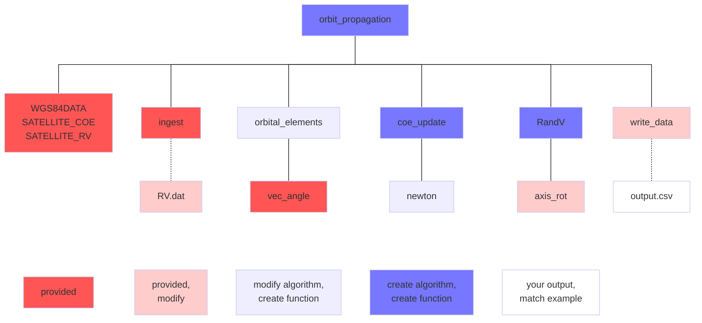

# ASTRO Project
See project description below these submission descriptions. 

# ASTRO1 input/output
Complete astro project until you can read inputs and correctly print position and velocity vectors to your output file. Provide a brief submission report (astro1.md) that documents your program's correct execution. 

## submission
- [ ] modified input file (RV.dat)
- [ ] modified driver script (orbit_propagation.m)
- [ ] modified output script (write_data.m)
- [ ] output file (output.csv)
- [ ] submission report

# ASTRO2 RV to COE
Complete astro project until you can correctly output initial COEs. Provide a brief submission report (astro2.md) that documents your program's correct execution. 
## submission
- [ ] modify any previous files as necessary
- [ ] RV to COE files (orbital_elements.m and subroutines)
	- [ ] functions
	- [ ] algorithms (for each function)
	- [ ] test scripts (for each function)
	- [ ] test documentation reports (for each function)
		- [ ] hand calculations as necessary
- [ ] submission report

# ASTRO3 COE to COE
Complete astro project until you can correctly output final COEs. Provide a brief submission report (astro3.md) that documents your program's correct execution. 
## submission
- [ ] modify any previous files as necessary
- [ ] COE to COE files (coe_update.m and subroutines)
	- [ ] functions
	- [ ] algorithms (for each function)
	- [ ] test scripts (for each function)
	- [ ] test documentation reports (for each function)
		- [ ] hand calculations as necessary
- [ ] submission report

# ASTRO4 COE to RV
Complete astro project until you can correctly output final position and velocity vectors. Provide a brief submission report (astro4.md) that documents your program's correct execution. 
## submission
- [ ] modify any previous files as necessary
- [ ] COE to RV files (RandV.m and subroutines)
	- [ ] functions
	- [ ] algorithms (for each function)
	- [ ] test scripts (for each function)
	- [ ] test documentation reports (for each function)
		- [ ] hand calculations as necessary
- [ ] submission report


# ASTRO5 presentation
Prepare and deliver a presentation describing your ASTRO project. Should include a presentation document—can be slideshow format (powerpoint) or report format (markdown or latex). Presentation should comprehensively cover the technical aspects of the project (how to propagate, etc.) but do not cover implementation details (how to write a line to a text file in matlab). 

Prepare a 5-10 min presentation. You may be asked to deliver only part of it. 

## submission
- [ ] presentation file 
- [ ] supporting files (images, etc.)

# ASTRO project: orbit propagation

Predict where a satellite will be in the future. 

Using matlab, create a program that can ingest a satellite’s position and velocity, determine where the satellite will be later, and calculate its future position. 


## assumptions

Earth-orbiting satellite

2-body motion


## input 

Input data is available in `RV.dat`. You will have to modify the input file during the course of the project. Each line contains one spacecraft ephemeris formatted as follows:

```
NAME␉YYYY-MM-DD HH:MM:SSZ␉Ri␉Rj␉Rk␉Vi␉Vj␉Vk␉tof
```
␉ represents a tab character (usually invisible). 

The date and time is the ISO 8601-standard epoch date and time. The letter *Z* indicates UTC. 

tof is the flight time (in seconds) to propagate the orbit. 


> [!NOTE]
>
> Your input function will likely be fragile and may break if your input file contains extra spaces. Do not place extra spaces at the end of a line, and do not add extra newline characters at the end of the file. 


### RV.dat modifications

The provided file `RV.dat` contains data for two spacecraft. Make these changes to tof (initially 0). 

- instance 1 (lines 1 & 2): no change
- instance 2 (lines 3 & 4): change tof to the spacecraft's orbital period (seconds, no decimals). 
	- After one orbit, a spacecraft's COE and RV outputs will be identical or nearly identical (case 1 ↔ case 3, case 2 ↔ case 4)
- instance 3 (lines 5 & 6): change tof to coincide with 2025-04-28 14:00:00Z
	- use matlab's `duration()` and `datetime()` commands to find the time between epoch and end date—you can do this manually since you only have to do it twice


## output

Your program will create and write data to the file `output.csv`. The file should containing the following output information:

```csv
units: km s deg, datetime, Ri, Rj, Rk, Vi, Vj, Vk, a, e, i, Ω, ω, ν, tof⏎
⏎
*** CASE 1 NAME ***⏎
input, x, x, x, x, x, x, x, x, x, x, x, x, x, x⏎
output, x, x, x, x, x, x, x, x, x, x, x, x, x⏎
⏎
*** CASE 2 NAME ***⏎
⋮
```

Correct data for case 1 is provided in [expected_output.csv](expected_output.csv). Note that the outputs are the same as the inputs because the satellite time of flight was zero. 

Your output should match exactly, including the number of decimals for each value. You can check this in matlab with the following command. 

``` matlab
visdiff('expected_output.csv', 'output.csv')
```

When opened in a CSV editor, the commas ensure that the labels and columns align. Units and columns are identified once at the beginning of the file.


> [!NOTE]
>
> Many spreadsheet programs automatically remove trailing zeros from decimal numbers. A text editor (matlab, notepad, notepad++) will show the file contents correctly.  


## program structure




## objectives

The purpose of this assignment is to gain familiarity with orbits and orbit propagation. 


## functions

Each function requires validation, which necessitates additional files. Follow instructions, templates, and examples referenced in [../templates/code validation.md](../templates/code%20validation.md). Place the files in the folders shown below. 

- complete algorithm `./algorithms/functionname.md` 
- matlab function `./functionname.m` 
- matlab test script `./tests/functionname_test.m`
- test documentation `./tests/functionname_test.md`
  - hand calculations if necessary
    - place image file in `./test/` folder
    - insert image in function_test.md

